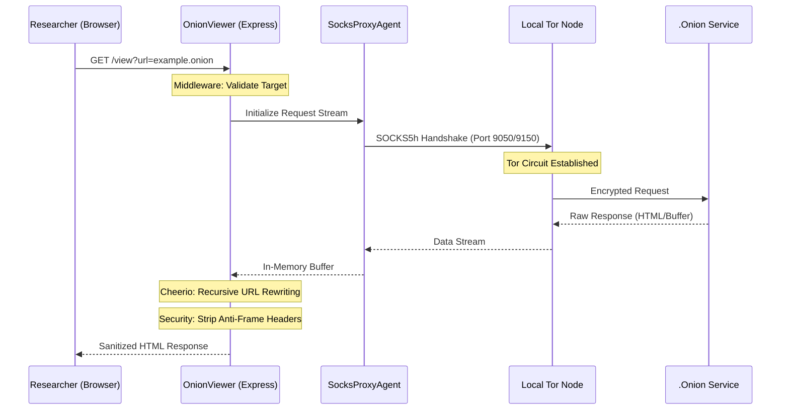

<p align="center">
  
</p>

<h1 align="center">🧅 OnionViewer</h1>

<p align="center">
  <b>Advanced High-Performance Backend Proxy & Tor-to-HTTP Tunneling Engine.</b>
</p>

<p align="center">
  
  
  
  
</p>

---

## 📖 Introduction

**OnionViewer** is a professional-grade intelligence tool designed for cybersecurity researchers, threat hunters, and OSINT specialists. Built by **CyberEthic** under the [**CyberEthic Research Lab**](https://cyberethic.in/), it solves the fundamental challenge of darkweb auditing: **navigating .onion services safely from a surface-web environment.**

The framework establishes a secure, local-only tunnel that proxies hidden services through Tor's network, performing real-time URL rewriting to ensure every interaction remains within the encrypted tunnel.

### 🎥 Demonstration

<div align="center">
  <video src="onionviewer.mp4" width="100%" controls autoplay muted loop>
    Your browser does not support the video tag.
  </video>
</div>

---

## 🧠 Technical Workflow (Backend Sequence)

This sequence diagram illustrates how **OnionViewer** handles a single request from the browser to the deep-web hidden service and back.



---

## 🔬 Core Research Pillars (Backend Engineering)

### 1. Tunneling & Network Abstraction (SocksProxyAgent & Axios)
The backend leverages **SocksProxyAgent** to wrap the entire communication layer in an encrypted SOCKS5h protocol. **Axios** is used to manage the stream, providing a robust interface for handling binary buffers and multi-port fallback (9050/9150). 
- **Backend Logic**: Ensures every request is "Tor-aware" before it leaves the local machine. The backend automatically detects the active Tor port and binds the agent to the outbound request.
- **Simple Way**: Ye part backend ko Tor network se jodta hai. Agar ek Tor port band ho, toh ye khud dusra port dhoondh kar connection banaye rakhta hai.

### 2. Recursive Stream Rewriting (Cheerio)
Once a response is received from the hidden service, the backend intercepts the response stream and uses **Cheerio** to perform recursive string manipulation on the raw buffer.
- **Backend Logic**: Scans for any string matching the destination's hostname or relative paths and replaces them with proxied URI structures (`/view?url=...`).
- **Simple Way**: Jab darkweb se data server par aata hai, toh backend usme se saare "dangerous" links nikal kar unhe "safe" proxy links mein badal deta hai.

---

## 📊 Technical Comparison Table

| Feature | Standard Browser (Tor Settings) | OnionViewer Proxy Engine |
| :--- | :--- | :--- |
| **DNS Resolution** | Often local (Leaky) | Enforced Remote (SOCKS5h) |
| **Traffic Handling** | Direct browser routing | Backend Intercepted & Rewritten |
| **Header Security** | Browser-level default | Custom Stripped (Bypass Blocks) |
| **URL Leaks** | High (Relative path leakage) | Zero (Recursive virtualization) |
| **Complexity** | Manual setup required | Plug-and-play local tunnel |
| **UI Persistence** | None (Site controls UI) | Professional Intelligence Dashboard |

---

## 🚀 Installation & Execution

```bash
# Clone the repository
git clone https://github.com/cyberethicc/OnionViewer.git

# Navigate and Install
cd OnionViewer
npm install

# Launch the engine
npm start
```

---

## 🔗 Connection Hub

- **Organization**: [CyberEthic Research Lab](https://cyberethic.in/)
- **GitHub**: [github.com/cyberethicc](https://github.com/cyberethicc)
- **LinkedIn**: [CyberEthic Intelligence](https://linkedin.com/company/cyberethicc)
- **Collaboration**: [Faizan Khan](https://github.com/faizan-khanx)

<p align="center">
  <b>Built by CyberEthic under the [CyberEthic Research Lab](https://cyberethic.in/).</b><br/>
  <b>Collaboration by [Faizan Khan](https://github.com/faizan-khanx)</b><br/>
  <sub>Research. Tools. Systems. Impact.</sub>
</p>
