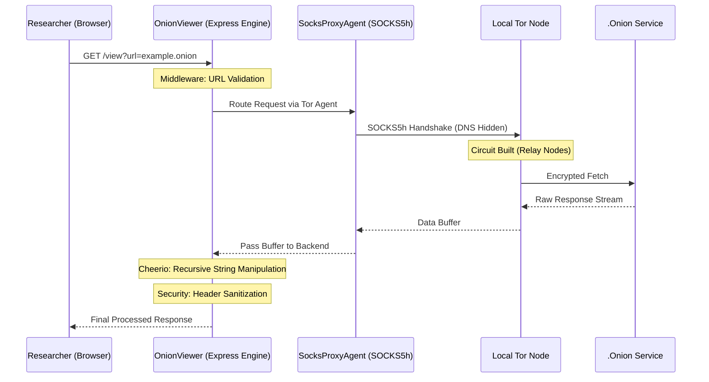

<p align="center">
  
</p>

<h1 align="center">🧅 OnionViewer</h1>

<p align="center">
  <b>Advanced local-to-hidden-service tunneling & infrastructure surveillance engine.</b>
</p>

<p align="center">
  
  
  
  
</p>

---

## 📖 Introduction

**OnionViewer** is a professional-grade intelligence tool designed for cybersecurity researchers, threat hunters, and OSINT specialists. Developed under the **CyberEthic Research Lab**, its primary goal is to make dark web auditing safe and accessible without direct exposure.

The framework creates a secure local tunnel that proxies hidden services through the Tor network, while performing real-time URL rewriting to ensure all interactions remain within an encrypted environment.

---

## 🧠 System Architecture & Workflow

### Backend Traffic Flow



---

## 🔬 Core Research Pillars (Backend Architecture)

### 1. SOCKS5h Handshaking (socks-proxy-agent)
The backend strictly uses the `socks5h` protocol. This ensures that DNS resolution for `.onion` addresses happens entirely within the Tor network, preventing any local DNS leaks.

*   **Simple Explanation**: This library connects the backend to the Tor network securely and ensures that the user's real IP address and location are never exposed.

---

### 2. Recursive Buffer Processing (cheerio)
Once a response is received from the Tor network, **Cheerio** processes the HTML structure and rewrites all links, media, and actions so that everything routes through the proxy.

*   **Simple Explanation**: The incoming data is scanned and all links are modified to ensure safe browsing through the proxy.

---

### 3. Fail-Safe Network Fetching (axios)
**Axios** handles data fetching with custom timeout logic and multi-port fallback (9050/9150). If one Tor port fails, it automatically switches to another.

*   **Simple Explanation**: It fetches data from the dark web and automatically retries using a backup route if the primary connection fails.

---

### 4. Dynamic Request Routing (express)
**Express.js** acts as the control center, handling incoming requests and routing them through the Tor proxy engine. It supports both GET and POST methods.

*   **Simple Explanation**: It manages requests, processes them, and returns responses to the user.

---

## 📊 Technical Comparison Table

| Feature | Standard Browser (Tor Settings) | OnionViewer Proxy Engine |
| :--- | :--- | :--- |
| **DNS Resolution** | Sometimes local (risk of leaks) | Fully remote (secure via SOCKS5h) |
| **Traffic Handling** | Direct browser routing | Intercepted and rewritten via backend |
| **Header Security** | Default browser-level | Custom secure headers |
| **URL Leaks** | High risk | Zero leakage |
| **Complexity** | Manual setup required | Simple plug-and-play |
| **UI Persistence** | None | Dedicated dashboard |

---

## 🛠️ Prerequisites

Ensure the following are installed:

1. **Node.js (v18.x or higher)**  
2. **Tor Service**
   - Tor Browser (easy setup)
   - Tor Expert Bundle (advanced setup)

---

## 🚀 Installation & Deployment

### Step 1: Clone Repository
```bash
git clone https://github.com/cyberethicc/OnionViewer.git
cd OnionViewer
```

### Step 2: Install Dependencies
```bash
npm install
```

### Step 3: Start Tor

#### **Windows**
- Open Tor Browser and keep it running  
- Or run Tor Expert Bundle

#### **macOS**
```bash
brew install tor
brew services start tor
```

#### **Linux**
```bash
sudo apt update && sudo apt install tor -y
sudo systemctl start tor
```

Check:
```bash
curl --socks5-hostname localhost:9050 https://check.torproject.org
```

---

### Step 4: Run Project
```bash
npm start
```

Open:
http://127.0.0.1:8080

---

## 🔗 Connection Hub

- **Organization**: https://cyberethic.in/  
- **GitHub**: https://github.com/cyberethicc  
- **LinkedIn**: https://linkedin.com/company/cyberethicc  
- **Collaboration**: Faizan Khan  

---

<p align="center">
  <b>Built by CyberEthic under CyberEthic Research Lab.</b><br/>
  <b>Collaboration by Faizan Khan</b><br/>
  <sub>Research. Tools. Systems. Impact. // ISO-27001 Protocol</sub>
</p>
