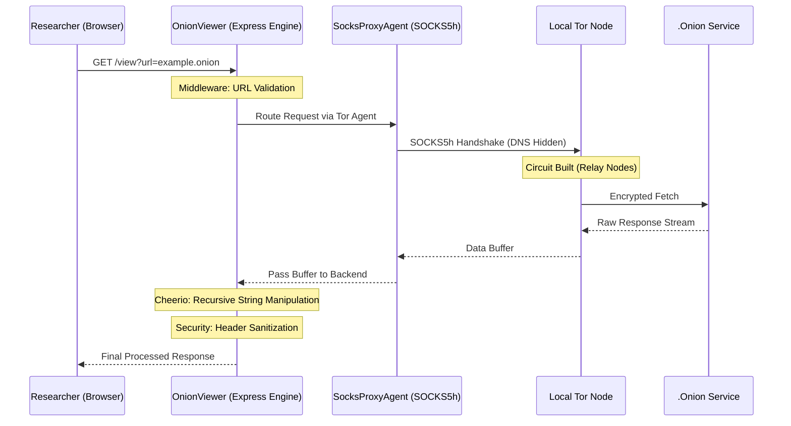

<p align="center">
  
</p>

<h1 align="center">🧅 OnionViewer</h1>

<p align="center">
  <b>Advanced local-to-hidden-service tunneling & infrastructure surveillance engine.</b>
</p>

<p align="center">
  
  
  
  
</p>

---

## 📖 Introduction

**OnionViewer** ek professional-grade intelligence tool hai jo cybersecurity researchers, threat hunters aur OSINT specialists ke liye design kiya gaya hai. Yeh **CyberEthic Research Lab** ke under develop hua hai, aur iska main goal hai darkweb auditing ko safe aur accessible banana — bina direct exposure ke.

Yeh framework ek secure local tunnel create karta hai jo Tor network ke through hidden services ko proxy karta hai, aur real-time URL rewriting karta hai taaki har interaction encrypted tunnel ke andar hi rahe.

---

## 🧠 System Architecture & Workflow

### Backend Traffic Flow



---

## 🔬 Core Research Pillars (Backend Architecture)

### 1. SOCKS5h Handshaking (socks-proxy-agent)
Backend strictly `socks5h` protocol use karta hai. Yeh ensure karta hai ki `.onion` address ka DNS resolution Tor network ke andar hi ho — koi bhi local DNS leak nahi hota.

*   **Simple Way**: Yeh library backend ko Tor ke secure tunnel se connect karti hai aur ensure karti hai ki user ka real IP ya location kabhi expose na ho.

---

### 2. Recursive Buffer Processing (cheerio)
Jab backend ko Tor network se response milta hai, tab **Cheerio** use hota hai HTML ko process karne ke liye. Yeh saare links, media aur actions ko rewrite karta hai taaki sab kuch proxy ke through hi chale.

*   **Simple Way**: Darkweb se aaya hua data scan hota hai aur uske saare links change ho jaate hain taaki browsing safe rahe.

---

### 3. Fail-Safe Network Fetching (axios)
**Axios** data fetch karne ke liye use hota hai, jisme custom timeout aur multi-port fallback system hai (9050/9150). Agar ek Tor port kaam na kare toh automatically dusra use ho jata hai.

*   **Simple Way**: Yeh darkweb se data laata hai aur agar ek connection fail ho jaye toh automatically backup route try karta hai.

---

### 4. Dynamic Request Routing (express)
**Express.js** poore system ka control center hai. Yeh incoming requests handle karta hai aur unhe Tor proxy engine tak route karta hai. GET aur POST dono support karta hai.

*   **Simple Way**: Yeh system ka dimag hai — request lena, process karna aur response dikhana sab handle karta hai.

---

## 📊 Technical Comparison Table

| Feature | Standard Browser (Tor Settings) | OnionViewer Proxy Engine |
| :--- | :--- | :--- |
| **DNS Resolution** | Kabhi kabhi local (leak ho sakta hai) | Fully remote (secure via SOCKS5h) |
| **Traffic Handling** | Direct browser routing | Backend se intercept aur rewrite |
| **Header Security** | Default browser level | Custom secure headers |
| **URL Leaks** | High chance | Zero leakage |
| **Complexity** | Manual setup | Simple plug-and-play |
| **UI Persistence** | Nahi | Dedicated dashboard |

---

## 🛠️ Prerequisites

Start karne se pehle yeh cheezein installed honi chahiye:

1. **Node.js (v18.x ya higher)**  
2. **Tor Service**
   - Tor Browser (easy setup)
   - Tor Expert Bundle (advanced use)

---

## 🚀 Installation & Deployment

### Step 1: Clone Repository
```bash
git clone https://github.com/cyberethicc/OnionViewer.git
cd OnionViewer
```

### Step 2: Install Dependencies
```bash
npm install
```

### Step 3: Start Tor

#### **Windows**
- Tor Browser open karke background me chala do  
- Ya Tor Expert Bundle run karo

#### **macOS**
```bash
brew install tor
brew services start tor
```

#### **Linux**
```bash
sudo apt update && sudo apt install tor -y
sudo systemctl start tor
```

Check:
```bash
curl --socks5-hostname localhost:9050 https://check.torproject.org
```

---

### Step 4: Run Project
```bash
npm start
```

Open:
http://127.0.0.1:8080

---

## 🔗 Connection Hub

- **Organization**: https://cyberethic.in/  
- **GitHub**: https://github.com/cyberethicc  
- **LinkedIn**: https://linkedin.com/company/cyberethicc  
- **Collaboration**: Faizan Khan  

---

<p align="center">
  <b>Built by CyberEthic under CyberEthic Research Lab.</b><br/>
  <b>Collaboration by Faizan Khan</b><br/>
  <sub>Research. Tools. Systems. Impact. // ISO-27001 Protocol</sub>
</p>
