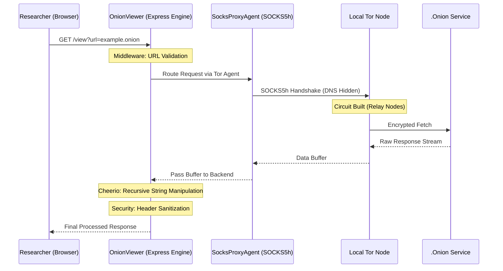

<p align="center">
  
</p>

<h1 align="center">🧅 OnionViewer</h1>

<p align="center">
  <b>Advanced local-to-hidden-service tunneling & infrastructure surveillance engine.</b>
</p>

<p align="center">
  
  
  
  
</p>

---

## 📖 Introduction

**OnionViewer** is a professional-grade intelligence tool designed for cybersecurity researchers, threat hunters, and OSINT specialists. Built by **CyberEthic** under the [**CyberEthic Research Lab**](https://cyberethic.in/), it solves the fundamental challenge of darkweb auditing: **navigating .onion services safely from a surface-web environment.**

The framework establishes a secure, local-only tunnel that proxies hidden services through Tor's network, performing real-time URL rewriting to ensure every interaction remains within the encrypted tunnel.

### 🎥 Demonstration

<div align="center">
  <video src="onionviewer.mp4" width="100%" controls autoplay muted loop>
    Your browser does not support the video tag.
  </video>
</div>

---

## 🧠 System Architecture & Workflow

### Backend Traffic Flow



---

## 🔬 Core Research Pillars (Backend Architecture)

### 1. SOCKS5h Handshaking (socks-proxy-agent)
The backend enforces a strict `socks5h` protocol. Unlike standard SOCKS5, the **SocksProxyAgent** library ensures that the DNS resolution of the `.onion` address happens entirely within the Tor network. This prevents local DNS leaks and ensures total network isolation at the protocol level.
*   **Simple Way**: Ye library humare backend ko Tor network ke "tunnel" se connect karti hai. Iska kaam ye hai ki aapka asli location aur address kabhi leak na ho.

### 2. Recursive Buffer Processing (cheerio)
Once the backend receives a response buffer from the Tor network, **Cheerio** is utilized to perform a high-speed, recursive transformation of the HTML structure. Every pointer (links, media, form actions) is rewritten in-memory to route through our proxy endpoint.
*   **Simple Way**: Jab darkweb se data humare server par aata hai, toh ye library us data ko scan karti hai aur uske saare links ko badal deti hai taaki aap safely browse kar sakein.

### 3. Fail-Safe Network Fetching (axios)
**Axios** serves as the primary transport layer. It is configured with custom timeout logic and multi-port fallback (9050/9150). If the primary Tor Expert Bundle port is unreachable, the backend automatically reroutes the request through the Tor Browser port.
*   **Simple Way**: Iska kaam hai data ko darkweb se "khinch" kar lana. Agar ek rasta band ho, toh ye khud dusra rasta (Tor port) dhoondh leta hai.

### 4. Dynamic Request Routing (express)
**Express.js** acts as the central brain, managing incoming requests and mapping them to the proxy engine. It handles both `GET` and `POST` methods, allowing for interactive navigation like searching or form submissions within the proxied hidden service.
*   **Simple Way**: Ye humare tool ka "dimag" hai jo sab kuch control karta hai—aapka search request lena, usse Tor par bhejna, aur result wapas dikhana.

---

## 📊 Technical Comparison Table

| Feature | Standard Browser (Tor Settings) | OnionViewer Proxy Engine |
| :--- | :--- | :--- |
| **DNS Resolution** | Often local (Leaky) | Enforced Remote (SOCKS5h) |
| **Traffic Handling** | Direct browser routing | Backend Intercepted & Rewritten |
| **Header Security** | Browser-level default | Custom Stripped (Bypass Blocks) |
| **URL Leaks** | High (Relative path leakage) | Zero (Recursive virtualization) |
| **Complexity** | Manual setup required | Plug-and-play local tunnel |
| **UI Persistence** | None (Site controls UI) | Professional Intelligence Dashboard |

---

## 🛠️ Prerequisites

Ensure you have the following installed before deployment:

1. **Node.js (v18.x or higher)**: The core backend runtime.
2. **Tor Service**: You need an active Tor node.
   - **Tor Browser**: Simplest way for beginners.
   - **Tor Expert Bundle**: Best for dedicated research stations.

---

## 🚀 Installation & Deployment

Follow these platform-specific instructions to deploy **OnionViewer**.

### Step 1: Clone the Repository
```bash
git clone https://github.com/cyberethicc/OnionViewer.git
cd OnionViewer
```

### Step 2: Install Dependencies
```bash
npm install
```

### Step 3: Start Tor (OS Specific)

#### **Windows**
- **Option A (Easy)**: Open **Tor Browser** and keep it running in the background.
- **Option B (Expert)**:
  1. Download [Tor Expert Bundle](https://www.torproject.org/download/tor/).
  2. Extract and run: `.\tor.exe` in your terminal.

#### **macOS**
- **Option A (Homebrew)**:
  ```bash
  brew install tor
  brew services start tor
  ```
- **Option B**: Launch **Tor Browser** and keep it minimized.

#### **Linux (Ubuntu/Debian)**
- **Install & Start Service**:
  ```bash
  sudo apt update && sudo apt install tor -y
  sudo systemctl start tor
  ```
- **Verify Connection**: `curl --socks5-hostname localhost:9050 https://check.torproject.org`

### Step 4: Launch OnionViewer
```bash
npm start
```

Open **`http://127.0.0.1:8080`** in your browser to start auditing.

---

## 🔗 Connection Hub

- **Organization**: [CyberEthic Research Lab](https://cyberethic.in/)
- **GitHub**: [github.com/cyberethicc](https://github.com/cyberethicc)
- **LinkedIn**: [CyberEthic Intelligence](https://linkedin.com/company/cyberethicc)
- **Collaboration**: [Faizan Khan](https://github.com/faizan-khanx)

<p align="center">
  <b>Built by CyberEthic under the [CyberEthic Research Lab](https://cyberethic.in/).</b><br/>
  <b>Collaboration by [Faizan Khan](https://github.com/faizan-khanx)</b><br/>
  <sub>Research. Tools. Systems. Impact. // ISO-27001 Protocol</sub>
</p>
